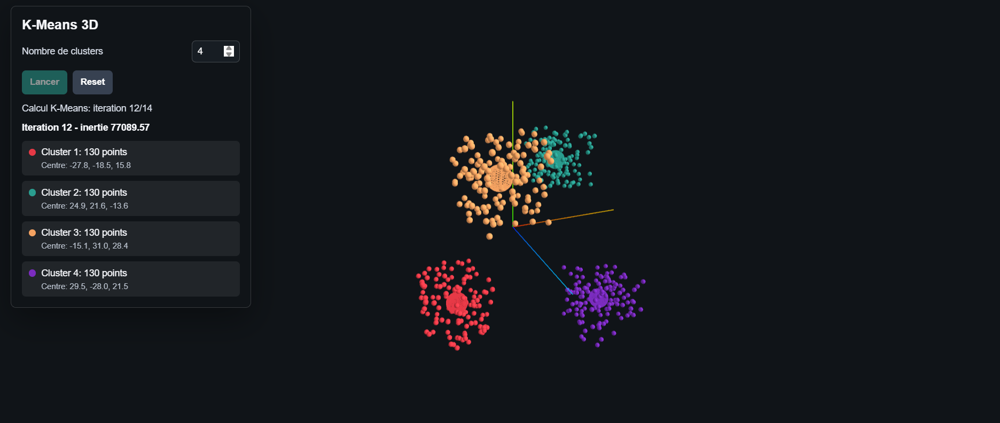

# K-Means-3D

Visualisation interactive d'un clustering K-Means en 3D avec Three.js.

## Lancer le projet

```bash
docker compose up -d --build
```

Ouvrir ensuite :

```text
http://localhost:8080
```

## Fonctionnalites

- Choix du nombre de clusters entre 2 et 6.
- Animation des iterations K-Means.
- Affichage des points par cluster.
- Affichage du centre de chaque cluster et de l'inertie.


